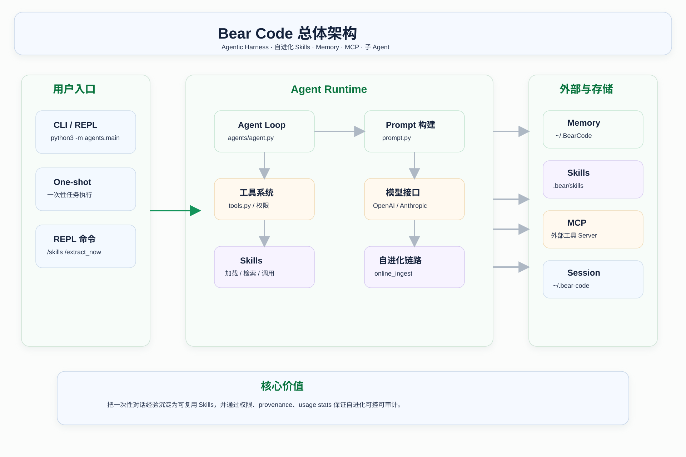

# Mosaic

**面向长程任务的 Coding Agent**

Mosaic 是一个基于 Python 的长程编码智能体。它把模型推理、文件与 Shell 工具、权限边界、上下文管理、会话恢复和工程技能演化统一编排进一条受控的 Agent Loop，专门解决 Agent 在跨越多轮、多文件、多次工具调用的复杂编码任务中出现的 **目标漂移、重复试错、上下文膨胀、中断不可恢复** 等问题。

模型只负责推理和提出工具调用意图，真正的环境操作由 Runtime 统一做权限判断、工具执行、结果回写、上下文压缩与经验沉淀。

> **名字的由来**：长程任务中，完整的原始对话会膨胀、失真。Mosaic 把历史拆解、提炼成一块块结构化的记忆碎片——任务目标、关键事件、当前子目标、阻塞点、工具经验——再像拼镶嵌画（Mosaic）一样把碎片重新拼合成对当前任务状态的完整图景。单看一块碎片信息有限，拼合起来就是全貌。

---

## 为什么需要 Mosaic

普通模型应用通常是：

```text
用户输入 -> 调用模型 -> 返回回复
```

Agent 真正困难的地方不是回答一个问题，而是**连续推进一个编码任务**。长程任务里会出现：

- 上下文越来越长，当前目标被历史信息淹没；
- 中间结论、工具结果和失败路径越来越多；
- Agent 反复重试已经失败的路径；
- 用户中途补充要求后，任务状态需要重新整理；
- 会话中断后，Agent 不知道自己做到哪里。

Mosaic 用一个清楚的 Agent Loop 把模型、工具、记忆、Skills、子 Agent、上下文和会话状态组织起来，让长任务始终保持**可控、可观察、可恢复**。

---

## 核心特性

- **完整 Agent Loop**：模型请求、tool call 解析、权限检查、工具执行、tool result 回写、继续推理、会话保存形成闭环。
- **长程记忆与状态重组**：将对话历史折叠为 `episode` / `working` / `tool` 三路结构化记忆，支持三路并行 LLM 生成；失败时保留原文回退，不丢关键状态。
- **四级上下文压缩流水线**：工具结果预算截断 → 过期结果修剪 → 空闲微压缩 → 完整折叠，在不丢失任务状态的前提下控制上下文体积。
- **编码工具集**：读 / 写 / 精确编辑 / 文件列表 / 正则搜索 / Shell，覆盖日常编码操作。
- **权限边界与 Plan Mode**：五级权限模式；Plan Mode 下只读分析、阻断写操作与 Shell；编辑前必须先读文件，并校验文件 mtime。
- **会话恢复**：自动保存 session，支持 `--resume` 中断续接。
- **工程技能演化**：从用户反馈中抽取可复用规则，通过 BM25 检索与 add / merge / discard 决策沉淀为 Skill，全程版本快照与 provenance 审计、可回滚。
- **OpenAI / Anthropic 双协议**：同一套 Runtime 支持 OpenAI-compatible 和 Anthropic-compatible 接口。
- **MCP 外部工具与子 Agent**：基于 stdio JSON-RPC 接入外部 MCP 工具；支持 explore / plan / general 子 Agent 处理局部任务。

---

## 架构



核心运行链路：

```text
用户输入
  -> agents/main.py
  -> Agent.chat()
  -> 懒加载 MCP / 检索 Skills / 预取 Memory
  -> 调用 OpenAI-compatible 或 Anthropic-compatible 模型
  -> 模型返回文本或 tool call
  -> Runtime 做权限检查
  -> 执行文件 / Shell / Skill / MCP / 子 Agent
  -> tool result 回写模型
  -> 必要时压缩和折叠上下文
  -> 保存 Session
  -> 后台执行 Skill 使用统计与在线演化
```

### 主链路闭环

```text
调模型 -> 有 tool_call? -> 权限检查 -> 执行工具 -> 结果回写
   ▲                                         │
   └─────────────────────────────────────────┘
              (无 tool_call 即给出最终回复)
```

---

## 目录结构

```text
Mosaic/
├── agents/
│   ├── main.py                    # CLI 入口、REPL、参数解析
│   ├── agent.py                   # Agent Runtime、模型调用、工具调度、上下文压缩
│   ├── tools.py                   # 内置编码工具和权限系统
│   ├── prompt.py                  # System prompt 动态构建
│   ├── skills.py                  # Skills 加载、BM25 检索、执行、创建和演化封装
│   ├── online_skill_evolution.py  # 在线 Skill 抽取和 add/merge/discard 决策
│   ├── skill_evolution.py         # Skill 落盘、版本快照、审计统计
│   ├── memory.py                  # 长期记忆系统
│   ├── session_memory.py          # 长程任务三路记忆折叠
│   ├── mcp_client.py              # MCP stdio JSON-RPC 客户端
│   ├── subagent.py                # 子 Agent 配置
│   ├── session.py                 # 会话保存与恢复
│   └── ui.py                      # 终端 UI 输出
├── .bear/
│   ├── skills/                    # 项目级 Skills
│   └── skill-evolution/           # Skills 自进化审计产物
├── data/                          # 评测数据集与折叠冒烟用例
├── paper/                         # 参考论文
├── wiki/                          # 项目文档中心
├── Dockerfile
├── requirements.txt
└── README.md
```

---

## 快速开始

### 1. 环境准备

推荐环境：

- Python 3.11+
- macOS / Linux
- Git
- ripgrep，可选但推荐
- 一个 OpenAI-compatible 或 Anthropic-compatible 模型接口

安装依赖：

```bash
python3 -m venv .venv
source .venv/bin/activate
pip install -r requirements.txt
```

### 2. 配置 `.env`

项目会自动读取当前目录或父目录中的 `.env`。

Anthropic-compatible 示例：

```env
APIKEY=sk-your-api-key
API=https://your-host/anthropic
MODEL=claude-sonnet-4-6
```

OpenAI-compatible 示例：

```env
OPENAI_API_KEY=sk-your-api-key
OPENAI_BASE_URL=https://your-host/v1
MODEL=gpt-4o
```

通用变量示例：

```env
APIKEY=sk-your-api-key
API=https://your-host/v1
MODEL=deepseek-chat
```

协议判断规则：

- `API` 或 `--api-base` 路径包含 `/anthropic` 时，按 Anthropic-compatible 调用。
- 否则有 OpenAI base URL 时，按 OpenAI-compatible 调用。
- `--model` 会覆盖 `.env` 中的 `MODEL`。

### 3. 启动 REPL

```bash
python3 -m agents.main
```

启动后直接输入编码任务，例如：

```text
阅读这个项目，告诉我 agent loop 是怎么跑起来的
```

### 4. 执行一次性任务

```bash
python3 -m agents.main "修复 src/app.ts 里的类型错误并跑通测试"
```

### 5. 使用 Plan Mode

Plan Mode 适合重构、复杂修复和多文件修改。它会先只读分析和写计划，用户审批后再执行。

```bash
python3 -m agents.main --plan "分析这个模块应该如何重构"
```

REPL 中也可以输入 `/plan` 切换。

### 6. 恢复最近会话

```bash
python3 -m agents.main --resume
```

### 7. 长程任务中的手动折叠

在长会话中，可以随时把历史折叠为结构化状态：

```text
/compact
```

也可以让模型在上下文变长、反复试错或工具失败累积时，主动调用 `compact_context` 工具进行折叠。

---

## 长程状态系统

Mosaic 的核心是把长对话折叠成**足够继续工作的状态**，而不是简单摘要。

### 三路结构化记忆

| 记忆 | 内容 |
|------|------|
| `episode_memory` | 任务描述、关键事件、当前进度 |
| `working_memory` | 当前子目标、阻塞点、下一步动作 |
| `tool_memory` | 已用工具、有效参数、常见错误与经验 |

- 支持三路并行 LLM 生成（`three_parallel`）或单次 JSON 生成（`single_json`）。
- 任一路径失败都会回退保留一段原文，不会丢失任务状态。
- 折叠后用结构化记忆替换旧历史，Agent 据此继续推进。

### 四级压缩流水线

| 级别 | 触发条件 | 动作 |
|------|----------|------|
| 预算截断 | 上下文利用率 > 50% | 截断超大工具结果（警戒 30k / 危急 15k 字符） |
| 过期修剪 | 利用率 > 60% | 旧读文件 / 搜索结果替换为占位符，同一文件只留最后一次 |
| 微压缩 | 空闲超过 5 分钟 | 清理已看完的旧工具结果 |
| 完整折叠 | 利用率 > 70% 或主动触发 | 用三路结构化记忆替换整段历史 |

此外，超过 30 KB 的工具结果会自动落盘为文件，上下文只保留引用与预览。

---

## 工程技能演化

Mosaic 可以从用户的明确反馈中抽取未来可复用的工程规则，并自动新增或合并到 `SKILL.md`。

设计刻意保守：用**下一轮用户反馈作为证据**，而不是让模型凭空判断自己该学什么。

```text
第 N 轮任务 + 回复
  -> 保存 pending window
第 N+1 轮用户反馈
  -> 合并为证据
  -> Extractor 至多抽取一个候选 Skill
  -> BM25 检索相似 Skills
  -> Maintainer 决策 add / merge / discard
  -> 写入或演化 SKILL.md
  -> 记录来源、版本快照与使用统计
```

- 精确身份匹配强制 merge；LLM 想新增但高度相似时强制改为 merge，避免技能重复堆积。
- 每次演化前保存版本快照到 `history/`，可回滚。
- 审计产物位于 `.bear/skill-evolution/`：`usage.jsonl`、`online_provenance.jsonl`、`skill_usage_stats.json`、`history/` 等。

---

## 评测

Mosaic 提供折叠对照评测入口：同一道题分别以 **fold-on / fold-off** 运行，交替执行顺序，保存逐题轨迹与配对汇总，用于检验结构化折叠是否有助于完成长任务。

先校验案例（不调用模型），再运行对照：

```bash
python3 -m agents.eval_folding --cases data/folding_eval_smoke.jsonl --output .bear/folding-eval/smoke-001 --validate-only
python3 -m agents.eval_folding --cases data/folding_eval_smoke.jsonl --output .bear/folding-eval/smoke-001 --fold-after-turn 2
```

折叠冒烟用例 [data/folding_eval_smoke.jsonl](data/folding_eval_smoke.jsonl) 会先注入口令 "BLUE"，折叠后追问口令，直接检验折叠是否丢失关键事实。

### 指标口径与诚实边界

- 本仓库评测默认开放只读工具，判分为规范化字符串匹配，**不是** GAIA / HLE 官方判分，生成的分数不能直接对标论文表格。
- Wiki 中用于说明方法的 `53.3%`、`20.2%`、`44.7%` 等数字**直接复用 [DeepAgent 论文](paper/deepAgents.pdf)的结果**，作为量化参照，并非 Mosaic 自测成绩。
- 过程指标（创建了多少 Skill、规则通过率）不等同于效果指标（任务成功率）。新旧 Skill 快照的完整端到端 A/B 是当前的下一步工作。

数据集与评测入口均在仓库中，可自行配置运行；详见 [wiki/折叠评测部分.md](wiki/折叠评测部分.md) 与 [项目评测.md](项目评测.md)。

---

## Docker

```bash
docker build -t mosaic .
docker run --rm -it mosaic
```

镜像基于 `python:3.11-slim`，内置 ripgrep、Node.js 与 Playwright Chromium。

---

## 来源与许可

本项目的基础 Agent Runtime 参考并复用了 [claude-code-from-scratch](https://github.com/Windy3f3f3f3f/claude-code-from-scratch) 的实现，包括工具、提示词、Memory、MCP 和子 Agent 等模块。上游代码采用 MIT 许可，原作者版权与完整许可文本见 [LICENSE](LICENSE)。Mosaic 在此基础上进行了修改和扩展，重点强化了面向长程编码任务的状态折叠、上下文压缩与工程技能演化。

---

## 更多文档

- [从 0 到 1 学习了解项目](wiki/从0到1学习了解项目.md)
- [架构设计](wiki/架构设计.md)
- [核心源码阅读指南](wiki/核心源码阅读指南.md)
- [技术亮点](wiki/技术亮点.md)
- [Skills 自进化逻辑与实现思路](wiki/Skills自进化逻辑与实现思路.md)
